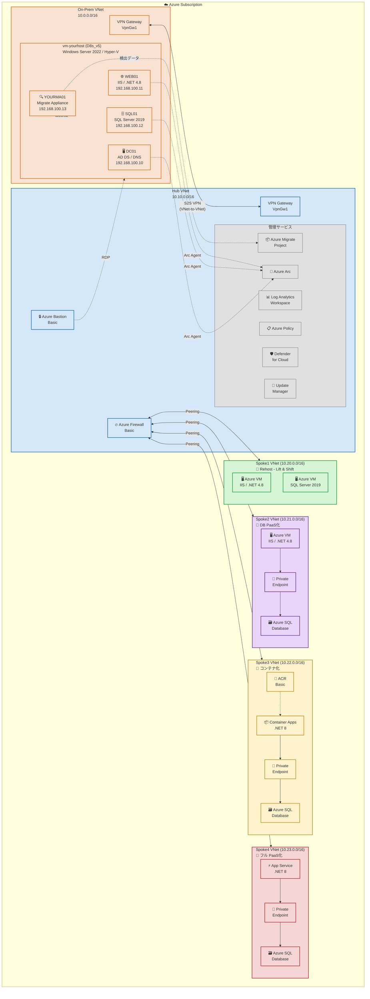
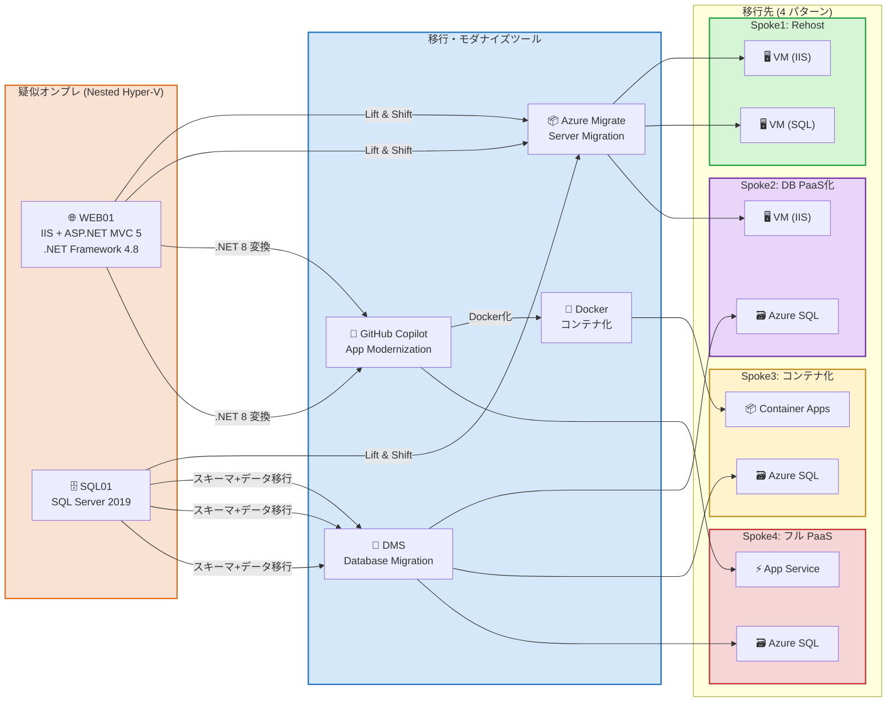
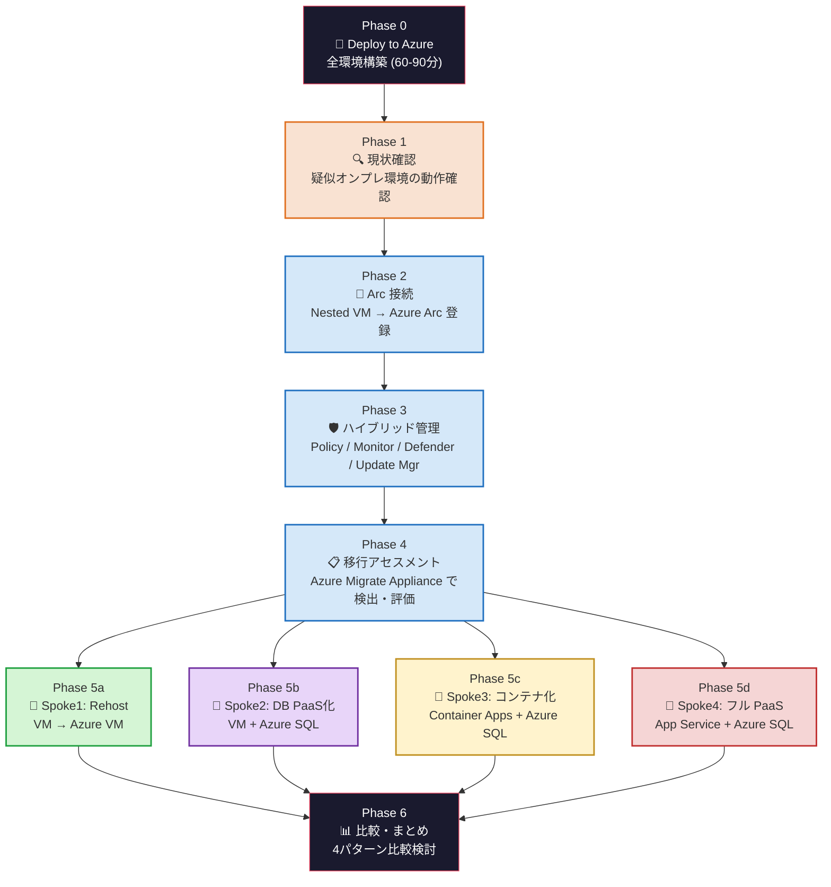
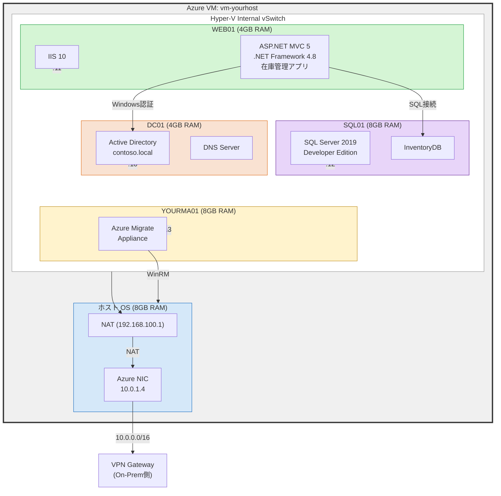

# アーキテクチャ図（Mermaid）

## 全体ネットワーク構成図

```mermaid
graph TB
    subgraph Azure["☁️ Azure Subscription"]

        subgraph OnPrem["On-Prem VNet<br/>10.0.0.0/16"]
            subgraph HyperVHost["vm-yourhost (D8s_v5)<br/>Windows Server 2022 / Hyper-V"]
                DC01["🖥️ DC01<br/>AD DS / DNS<br/>192.168.100.10"]
                WEB01["🌐 WEB01<br/>IIS / .NET 4.8<br/>192.168.100.11"]
                SQL01["🗄️ SQL01<br/>SQL Server 2019<br/>192.168.100.12"]
                MA01["🔍 YOURMA01<br/>Migrate Appliance<br/>192.168.100.13"]
            end
            VPNGW_OP["VPN Gateway<br/>VpnGw1"]
        end

        subgraph Hub["Hub VNet<br/>10.10.0.0/16"]
            FW["🔥 Azure Firewall<br/>Basic"]
            VPNGW_HUB["VPN Gateway<br/>VpnGw1"]
            BASTION["🔒 Azure Bastion<br/>Basic"]
            subgraph Mgmt["管理サービス"]
                LAW["📊 Log Analytics<br/>Workspace"]
                POLICY["📋 Azure Policy"]
                DEFENDER["🛡️ Defender<br/>for Cloud"]
                ARC["🔗 Azure Arc"]
                MIGRATE["📦 Azure Migrate<br/>Project"]
                UPDATE["🔄 Update<br/>Manager"]
            end
        end

        subgraph Spoke1["Spoke1 VNet (10.20.0.0/16)<br/>🔹 Rehost - Lift & Shift"]
            S1_WEB["🖥️ Azure VM<br/>IIS / .NET 4.8"]
            S1_SQL["🖥️ Azure VM<br/>SQL Server 2019"]
        end

        subgraph Spoke2["Spoke2 VNet (10.21.0.0/16)<br/>🔹 DB PaaS化"]
            S2_WEB["🖥️ Azure VM<br/>IIS / .NET 4.8"]
            S2_SQL["🗃️ Azure SQL<br/>Database"]
            S2_PE["🔐 Private<br/>Endpoint"]
        end

        subgraph Spoke3["Spoke3 VNet (10.22.0.0/16)<br/>🔹 コンテナ化"]
            S3_ACA["📦 Container Apps<br/>.NET 8"]
            S3_ACR["🐳 ACR<br/>Basic"]
            S3_SQL["🗃️ Azure SQL<br/>Database"]
            S3_PE["🔐 Private<br/>Endpoint"]
        end

        subgraph Spoke4["Spoke4 VNet (10.23.0.0/16)<br/>🔹 フル PaaS化"]
            S4_APP["⚡ App Service<br/>.NET 8"]
            S4_SQL["🗃️ Azure SQL<br/>Database"]
            S4_PE["🔐 Private<br/>Endpoint"]
        end
    end

    %% VPN 接続
    VPNGW_OP <-->|"S2S VPN<br/>(VNet-to-VNet)"| VPNGW_HUB

    %% Hub-Spoke Peering
    FW <-->|"Peering"| Spoke1
    FW <-->|"Peering"| Spoke2
    FW <-->|"Peering"| Spoke3
    FW <-->|"Peering"| Spoke4

    %% Bastion 接続
    BASTION -.->|"RDP"| HyperVHost

    %% Private Endpoint 接続
    S2_WEB --> S2_PE --> S2_SQL
    S3_ACA --> S3_PE --> S3_SQL
    S3_ACR -.-> S3_ACA
    S4_APP --> S4_PE --> S4_SQL

    %% 管理接続 (Arc)
    DC01 -.->|"Arc Agent"| ARC
    WEB01 -.->|"Arc Agent"| ARC
    SQL01 -.->|"Arc Agent"| ARC

    %% Migrate 接続
    MA01 -.->|"WinRM"| HyperVHost
    MA01 -.->|"検出データ"| MIGRATE

    %% スタイル
    classDef onprem fill:#f9e2d2,stroke:#e07020,stroke-width:2px
    classDef hub fill:#d5e8f9,stroke:#2070c0,stroke-width:2px
    classDef spoke1 fill:#d5f5d5,stroke:#20a040,stroke-width:2px
    classDef spoke2 fill:#e8d5f9,stroke:#7030a0,stroke-width:2px
    classDef spoke3 fill:#fff3cd,stroke:#c09020,stroke-width:2px
    classDef spoke4 fill:#f5d5d5,stroke:#c03030,stroke-width:2px
    classDef mgmt fill:#e0e0e0,stroke:#606060,stroke-width:1px

    class OnPrem,HyperVHost,DC01,WEB01,SQL01,MA01,VPNGW_OP onprem
    class Hub,FW,VPNGW_HUB,BASTION hub
    class Spoke1,S1_WEB,S1_SQL spoke1
    class Spoke2,S2_WEB,S2_SQL,S2_PE spoke2
    class Spoke3,S3_ACA,S3_ACR,S3_SQL,S3_PE spoke3
    class Spoke4,S4_APP,S4_SQL,S4_PE spoke4
    class Mgmt,LAW,POLICY,DEFENDER,ARC,MIGRATE,UPDATE mgmt
```

## 移行フロー図

```mermaid
flowchart LR
    subgraph Source["疑似オンプレ (Nested Hyper-V)"]
        WEB01["🌐 WEB01<br/>IIS + ASP.NET MVC 5<br/>.NET Framework 4.8"]
        SQL01["🗄️ SQL01<br/>SQL Server 2019"]
    end

    subgraph Tools["移行・モダナイズツール"]
        AM["📦 Azure Migrate<br/>Server Migration"]
        DMS["🔄 DMS<br/>Database Migration"]
        COPILOT["🤖 GitHub Copilot<br/>App Modernization"]
        DOCKER["🐳 Docker<br/>コンテナ化"]
    end

    subgraph Targets["移行先 (4 パターン)"]
        subgraph T1["Spoke1: Rehost"]
            T1W["🖥️ VM (IIS)"]
            T1D["🖥️ VM (SQL)"]
        end
        subgraph T2["Spoke2: DB PaaS化"]
            T2W["🖥️ VM (IIS)"]
            T2D["🗃️ Azure SQL"]
        end
        subgraph T3["Spoke3: コンテナ化"]
            T3W["📦 Container Apps"]
            T3D["🗃️ Azure SQL"]
        end
        subgraph T4["Spoke4: フル PaaS"]
            T4W["⚡ App Service"]
            T4D["🗃️ Azure SQL"]
        end
    end

    WEB01 -->|"Lift & Shift"| AM --> T1W
    SQL01 -->|"Lift & Shift"| AM --> T1D

    WEB01 -->|"Lift & Shift"| AM --> T2W
    SQL01 -->|"スキーマ+データ移行"| DMS --> T2D

    WEB01 -->|".NET 8 変換"| COPILOT -->|"Docker化"| DOCKER --> T3W
    SQL01 -->|"スキーマ+データ移行"| DMS --> T3D

    WEB01 -->|".NET 8 変換"| COPILOT --> T4W
    SQL01 -->|"スキーマ+データ移行"| DMS --> T4D

    style Source fill:#f9e2d2,stroke:#e07020,stroke-width:2px
    style Tools fill:#d5e8f9,stroke:#2070c0,stroke-width:2px
    style T1 fill:#d5f5d5,stroke:#20a040,stroke-width:2px
    style T2 fill:#e8d5f9,stroke:#7030a0,stroke-width:2px
    style T3 fill:#fff3cd,stroke:#c09020,stroke-width:2px
    style T4 fill:#f5d5d5,stroke:#c03030,stroke-width:2px
```

## ハンズオンフェーズ遷移図

```mermaid
flowchart TD
    P0["Phase 0<br/>🚀 Deploy to Azure<br/>全環境構築 (60-90分)"]
    P1["Phase 1<br/>🔍 現状確認<br/>疑似オンプレ環境の動作確認"]
    P2["Phase 2<br/>🔗 Arc 接続<br/>Nested VM → Azure Arc 登録"]
    P3["Phase 3<br/>🛡️ ハイブリッド管理<br/>Policy / Monitor / Defender / Update Mgr"]
    P4["Phase 4<br/>📋 移行アセスメント<br/>Azure Migrate Appliance で検出・評価"]

    P5A["Phase 5a<br/>🔹 Spoke1: Rehost<br/>VM → Azure VM"]
    P5B["Phase 5b<br/>🔹 Spoke2: DB PaaS化<br/>VM + Azure SQL"]
    P5C["Phase 5c<br/>🔹 Spoke3: コンテナ化<br/>Container Apps + Azure SQL"]
    P5D["Phase 5d<br/>🔹 Spoke4: フル PaaS<br/>App Service + Azure SQL"]

    P6["Phase 6<br/>📊 比較・まとめ<br/>4パターン比較検討"]

    P0 --> P1 --> P2 --> P3 --> P4
    P4 --> P5A
    P4 --> P5B
    P4 --> P5C
    P4 --> P5D
    P5A --> P6
    P5B --> P6
    P5C --> P6
    P5D --> P6

    style P0 fill:#1a1a2e,color:#fff,stroke:#e94560
    style P1 fill:#f9e2d2,stroke:#e07020,stroke-width:2px
    style P2 fill:#d5e8f9,stroke:#2070c0,stroke-width:2px
    style P3 fill:#d5e8f9,stroke:#2070c0,stroke-width:2px
    style P4 fill:#d5e8f9,stroke:#2070c0,stroke-width:2px
    style P5A fill:#d5f5d5,stroke:#20a040,stroke-width:2px
    style P5B fill:#e8d5f9,stroke:#7030a0,stroke-width:2px
    style P5C fill:#fff3cd,stroke:#c09020,stroke-width:2px
    style P5D fill:#f5d5d5,stroke:#c03030,stroke-width:2px
    style P6 fill:#1a1a2e,color:#fff,stroke:#e94560
```

## Nested Hyper-V 内部構成図

```mermaid
graph TB
    subgraph AzureVM["Azure VM: vm-yourhost<br/>Standard_D8s_v5 (8vCPU / 32GB RAM)<br/>Windows Server 2022 + Hyper-V"]
        subgraph HostOS["ホスト OS (8GB RAM)"]
            NAT["NAT (192.168.100.1)"]
            AzureNIC["Azure NIC<br/>10.0.1.4"]
        end

        subgraph vSwitch["Hyper-V Internal vSwitch<br/>192.168.100.0/24"]
            subgraph DC["DC01 (4GB RAM)"]
                AD["Active Directory<br/>contoso.local"]
                DNS["DNS Server"]
            end
            subgraph WEB["WEB01 (4GB RAM)"]
                IIS["IIS 10"]
                APP["ASP.NET MVC 5<br/>.NET Framework 4.8<br/>在庫管理アプリ"]
            end
            subgraph SQL["SQL01 (8GB RAM)"]
                SQLSRV["SQL Server 2019<br/>Developer Edition"]
                SQLDB["InventoryDB"]
            end
            subgraph MA["YOURMA01 (8GB RAM)"]
                APPLIANCE["Azure Migrate<br/>Appliance"]
            end
        end
    end

    NAT -->|"NAT"| AzureNIC
    AzureNIC -->|"10.0.0.0/16"| VPN["VPN Gateway<br/>(On-Prem側)"]

    DC -->|".10"| vSwitch
    WEB -->|".11"| vSwitch
    SQL -->|".12"| vSwitch
    MA -->|".13"| vSwitch
    vSwitch --> NAT

    APP -->|"Windows認証"| AD
    APP -->|"SQL接続"| SQLDB
    APPLIANCE -->|"WinRM"| HostOS

    style AzureVM fill:#f0f0f0,stroke:#333,stroke-width:3px
    style HostOS fill:#d5e8f9,stroke:#2070c0
    style vSwitch fill:#fff,stroke:#999
    style DC fill:#f9e2d2,stroke:#e07020
    style WEB fill:#d5f5d5,stroke:#20a040
    style SQL fill:#e8d5f9,stroke:#7030a0
    style MA fill:#fff3cd,stroke:#c09020
```
