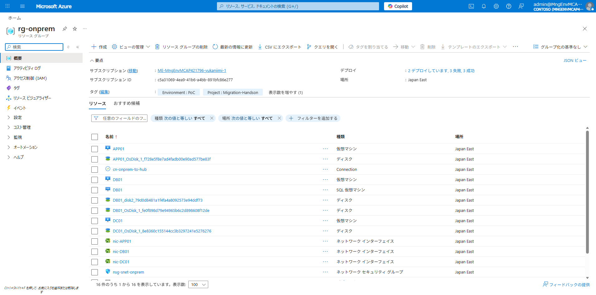
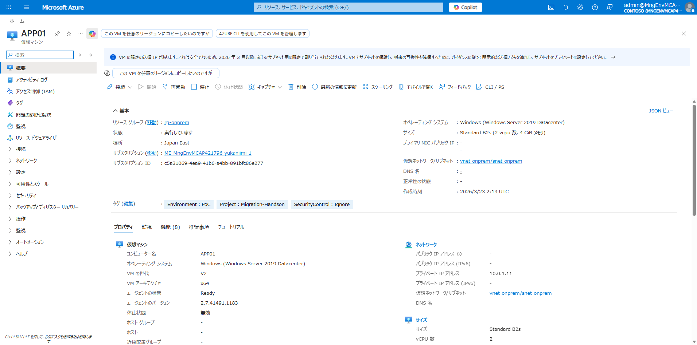
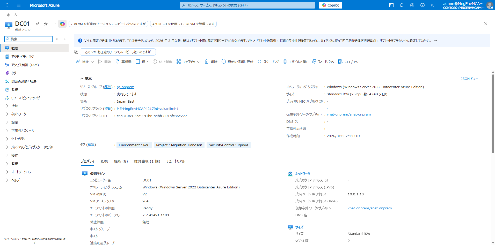
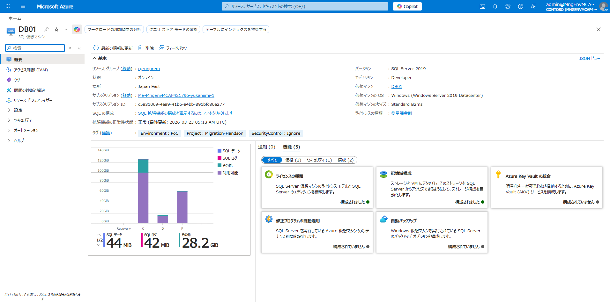

# Phase 1: 現状確認

## 目的

疑似オンプレ環境（DC01 / APP01 / DB01）に接続し、既存アプリケーションの動作を確認します。

## 前提条件

- Phase 0 のデプロイが完了していること

## 構成

| VM 名 | 役割 | IP アドレス | OS |
|-------|------|------------|-----|
| DC01 | AD DS / DNS | 10.0.1.10 | Windows Server 2022 |
| APP01 | IIS + ASP.NET MVC 5 | 10.0.1.11 | Windows Server 2019 |
| DB01 | SQL Server 2019 | 10.0.1.12 | Windows Server 2019 |

## 手順

### 1. リソースグループの確認

Azure Portal で `rg-onprem` リソースグループを開き、3 台の VM（DC01 / APP01 / DB01）が作成されていることを確認します。



### 2. APP01 の確認（IIS + .NET Framework 4.8）

Azure Portal → `rg-onprem` → `APP01` を開き、VM が実行中であることを確認します。

- **状態**: 実行しています
- **プライベート IP**: 10.0.1.11
- **OS**: Windows Server 2019 Datacenter
- **サイズ**: Standard B2s



Azure Bastion 経由で RDP 接続し、サンプルアプリ（在庫管理システム）の動作確認を行います。

1. Azure Portal → `rg-onprem` → `APP01` → **接続** → **Bastion**
2. ユーザー名: `azureadmin`、パスワード: デプロイ時に設定した値を入力
3. **接続** をクリック
4. APP01 上のブラウザで `http://localhost` にアクセス

### 3. DC01 の確認（AD DS / DNS）

Azure Portal → `rg-onprem` → `DC01` を開き、VM が実行中であることを確認します。

- **状態**: 実行しています
- **プライベート IP**: 10.0.1.10
- **OS**: Windows Server 2022 Datacenter Azure Edition
- **サイズ**: Standard B2s



Bastion で DC01 に接続し、AD DS の構成を確認:

1. **Server Manager** → **Tools** → **Active Directory Users and Computers**
2. ドメイン `contoso.local` の構成を確認
   - OU=Servers、OU=ServiceAccounts

### 4. DB01 の確認（SQL Server 2019）

Azure Portal → `rg-onprem` → `DB01`（SQL 仮想マシン）を開き、SQL Server の構成を確認します。

- **バージョン**: SQL Server 2019
- **エディション**: Developer
- **仮想マシンの OS**: Windows Server 2019
- **サイズ**: Standard B2ms



Bastion で DB01 に接続し、データベースの確認:

1. **SQL Server Management Studio** を開く
2. Windows 認証で接続
3. `InventoryDB` データベースの存在と `Products` テーブル（8 件のサンプルデータ）を確認

### 5. ネットワーク疎通の確認

APP01 から以下の疎通を確認:

```powershell
# DC01 への疎通（DNS: ポート 53）
Test-NetConnection -ComputerName 10.0.1.10 -Port 53

# DB01 (SQL Server) への疎通（SQL: ポート 1433）
Test-NetConnection -ComputerName 10.0.1.12 -Port 1433
```

両方とも `TcpTestSucceeded: True` が返ることを確認します。

> **注意**: DB01 の Windows Firewall で TCP 1433 が開放されていない場合は、以下を DB01 上で実行してください:
> ```powershell
> New-NetFirewallRule -DisplayName 'Allow SQL Server' -Direction Inbound -Protocol TCP -LocalPort 1433 -Action Allow
> ```

## 確認ポイント

- [x] 3 台の VM（DC01 / APP01 / DB01）がすべて実行中であること
- [ ] APP01 でサンプルアプリが正常動作すること
- [x] DC01 で AD DS が構成されていること
- [x] DB01 で SQL Server 2019 と InventoryDB（Products テーブル + サンプルデータ 8 件）が存在すること
- [x] APP01 → DC01 (DNS:53) の疎通が確認できること
- [x] APP01 → DB01 (SQL:1433) の疎通が確認できること

## 次のステップ

→ [Phase 2: Arc 接続](02-arc-onboard.md)
