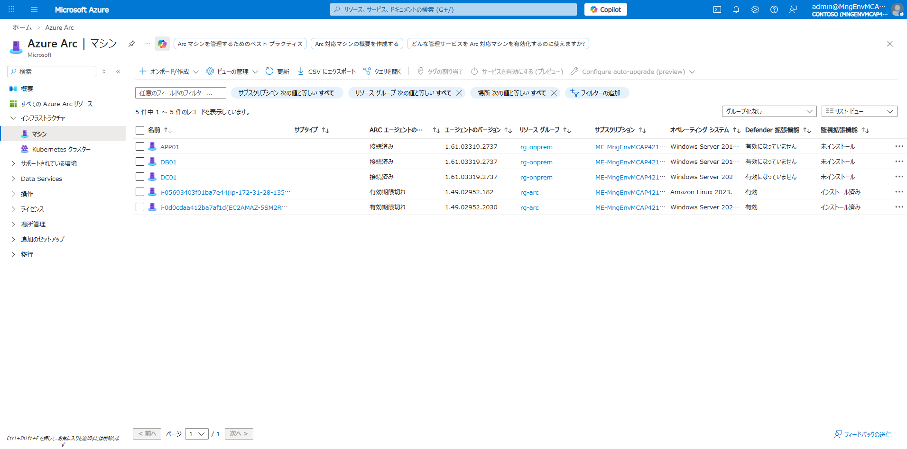
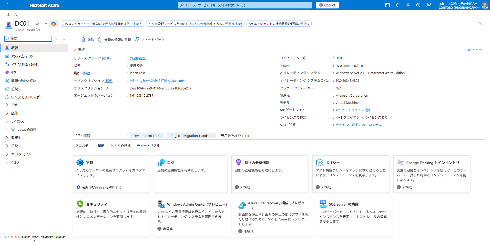
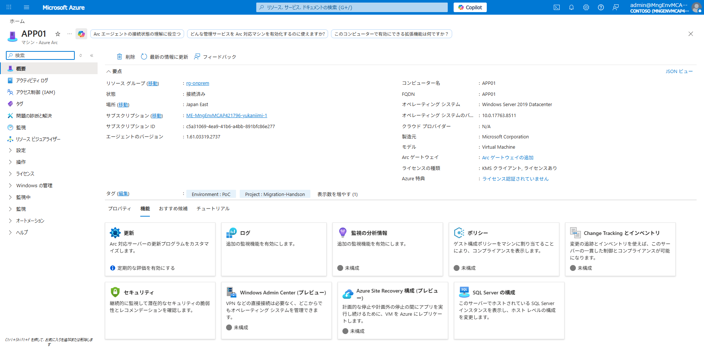

# Phase 2: Azure Arc 接続

## 目的

疑似オンプレ VM（DC01 / APP01 / DB01）を Azure Arc に登録し、Azure からの一元管理を可能にします。

## 前提条件

- Phase 1 が完了していること
- 各 VM から Azure エンドポイントへの HTTPS 通信が可能であること

## 重要: IMDS ブロックの設定

疑似オンプレ VM は実際には Azure VM であるため、Azure Arc Agent をインストールする前に **IMDS（Instance Metadata Service）へのアクセスをブロック** する必要があります。

各 VM（DC01, APP01, DB01）で以下を実行します。`az vm run-command invoke` を使用してリモート実行できます。

```powershell
# 各 VM で IMDS エンドポイントをブロック
foreach ($vm in @("DC01", "APP01", "DB01")) {
    az vm run-command invoke `
        --resource-group rg-onprem `
        --name $vm `
        --command-id RunPowerShellScript `
        --scripts "New-NetFirewallRule -Name 'BlockIMDS' -DisplayName 'Block IMDS' -Direction Outbound -RemoteAddress 169.254.169.254 -Action Block"
}
```

## 手順

### 1. サービスプリンシパルの作成

非対話式に Arc エージェントを接続するためのサービスプリンシパルを作成します。

```powershell
az ad sp create-for-rbac `
    --name "sp-arc-onboarding" `
    --role "Azure Connected Machine Onboarding" `
    --scopes "/subscriptions/<your-subscription-id>/resourceGroups/rg-onprem"
```

出力の `appId` と `password` を控えておきます。

### 2. Arc Agent のインストールと接続（各 VM で実施）

`az vm run-command invoke` を使用して各 VM にリモートでインストール・接続します。

**インストール:**

```powershell
az vm run-command invoke `
    --resource-group rg-onprem `
    --name <VM名> `
    --command-id RunPowerShellScript `
    --scripts "[Net.ServicePointManager]::SecurityProtocol = [Net.SecurityProtocolType]::Tls12; New-Item -Path C:\temp -ItemType Directory -Force | Out-Null; Invoke-WebRequest -Uri 'https://aka.ms/azcmagent-windows' -OutFile 'C:\temp\install_windows_azcmagent.ps1' -UseBasicParsing; Set-ExecutionPolicy Bypass -Scope Process -Force; C:\temp\install_windows_azcmagent.ps1"
```

**接続（サービスプリンシパル使用）:**

```powershell
az vm run-command invoke `
    --resource-group rg-onprem `
    --name <VM名> `
    --command-id RunPowerShellScript `
    --scripts "& 'C:\Program Files\AzureConnectedMachineAgent\azcmagent.exe' connect --resource-group rg-onprem --tenant-id <tenant-id> --location japaneast --subscription-id <subscription-id> --service-principal-id <appId> --service-principal-secret '<password>' --tags 'Environment=PoC,Project=Migration-Handson,SecurityControl=Ignore'"
```

> **注意**: `azcmagent.exe` はフルパスで指定する必要があります。リモート実行環境では PATH が正しく設定されない場合があるためです。

### 3. 登録対象

| VM | 登録先 RG | OS | 備考 |
|----|----------|-----|------|
| DC01 | rg-onprem | Windows Server 2022 Datacenter Azure Edition | AD DS / DNS |
| APP01 | rg-onprem | Windows Server 2019 Datacenter | IIS + .NET Framework 4.8 |
| DB01 | rg-onprem | Windows Server 2019 Datacenter | SQL Server 2019 Developer + SQL Server 拡張 |

### 4. Arc-enabled SQL Server の設定（DB01）

DB01 では Arc 接続時に SQL Server 用の Azure 拡張機能（`WindowsAgent.SqlServer` / `MicrosoftDefenderForSQL`）が自動的にインストールされます。

Azure Portal → Azure Arc → SQL Server で DB01 の SQL Server インスタンスが検出されていることを確認します。

### 5. 登録の確認

Azure Portal → **Azure Arc** → **マシン** で 3 台の VM が「接続済み」で表示されることを確認します。



**CLI での確認:**

```powershell
az connectedmachine list --resource-group rg-onprem `
    --query "[].{Name:name,Status:status,OS:osName,Location:location}" -o table
```

```text
Name    Status     OS       Location
------  ---------  -------  ----------
DC01    Connected  windows  japaneast
APP01   Connected  windows  japaneast
DB01    Connected  windows  japaneast
```

### 6. 各 VM の Arc 詳細

**DC01（AD DS / DNS サーバー）:**



- コンピューター名: DC01
- FQDN: DC01.contoso.local
- OS: Windows Server 2022 Datacenter Azure Edition
- タグ: `Environment: PoC`, `Project: Migration-Handson`

**APP01（Web アプリサーバー）:**



- コンピューター名: APP01
- OS: Windows Server 2019 Datacenter
- タグ: `Environment: PoC`, `Project: Migration-Handson`

**DB01（SQL Server）:**


- コンピューター名: DB01
- OS: Windows Server 2019 Datacenter
- SQL Server 拡張: `WindowsAgent.SqlServer` インストール済み
- Defender for SQL 拡張: `MicrosoftDefenderForSQL` インストール済み
- タグ: `Environment: PoC`, `Project: Migration-Handson`

## 確認ポイント

- [x] 3 台すべてが Arc に登録済み（Status: Connected）
- [x] タグが正しく設定されていること（`Environment: PoC`, `Project: Migration-Handson`）
- [x] DB01 で SQL Server 拡張機能（`WindowsAgent.SqlServer`）がインストール済み
- [x] DB01 で Defender for SQL 拡張機能がインストール済み

## 次のステップ

→ [Phase 3: ハイブリッド管理](03-hybrid-mgmt.md)
