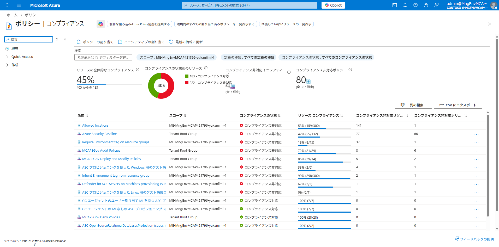
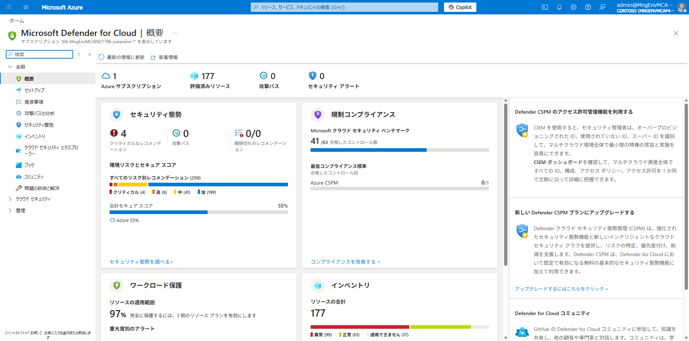
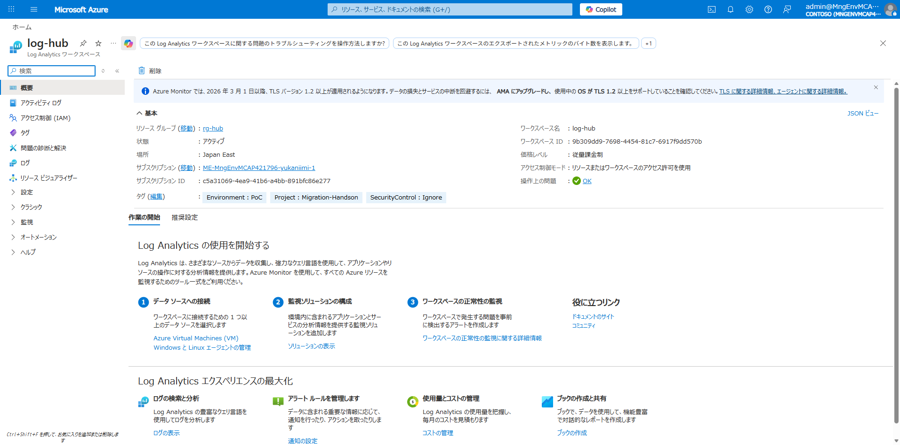

# Phase 3: ハイブリッド管理

## 目的

Azure Arc に登録した VM に対して、Azure のガバナンス・監視・セキュリティ機能を適用します。

## 前提条件

- Phase 2 が完了していること（3 台が Arc 登録済み）

## 手順

### 1. Azure Policy の確認

デプロイ時に適用済みのポリシーを確認します。

#### CLI での確認

```powershell
az policy assignment list `
  --scope "/subscriptions/<subscription-id>" `
  --query "[].{Name:displayName,Enforcement:enforcementMode}" -o table
```

**実行結果:**

| ポリシー | 効果 | 適用モード |
|---------|------|-----------|
| Allowed locations | Deny | Default |
| Require Environment tag on resource groups | Deny | Default |
| Inherit Environment tag from resource group | Modify | Default |
| Defender for SQL Servers on Machines provisioning | - | Default |
| ASC プロビジョニング（Windows/Linux ゲスト構成エージェント） | - | Default |

#### Azure Portal での確認

Azure Portal → **Policy** → **Compliance** で全体のコンプライアンス状態を確認:



### 2. Azure Monitor の設定

#### Azure Monitor Agent (AMA) のインストール

Azure CLI で Arc マシンに AMA 拡張機能をインストールします:

```powershell
# 3台すべてに AMA をインストール
foreach ($vm in @("DC01","APP01","DB01")) {
  az connectedmachine extension create `
    --machine-name $vm `
    --resource-group rg-onprem `
    --name AzureMonitorWindowsAgent `
    --type AzureMonitorWindowsAgent `
    --publisher Microsoft.Azure.Monitor `
    --location japaneast `
    --no-wait
}
```

プロビジョニング完了を確認:

```powershell
foreach ($vm in @("DC01","APP01","DB01")) {
  $state = az connectedmachine extension show `
    --machine-name $vm -g rg-onprem `
    --name AzureMonitorWindowsAgent `
    --query "properties.provisioningState" -o tsv
  Write-Host "${vm}: $state"
}
# DC01: Succeeded
# APP01: Succeeded
# DB01: Succeeded
```

#### データ収集ルール (DCR) の作成

REST API で DCR を作成し、Arc マシンに関連付けます:

```powershell
# DCR 作成（VMInsights パフォーマンスカウンター + Windows イベントログ）
az rest --method put `
  --url "https://management.azure.com/subscriptions/<subscription-id>/resourceGroups/rg-hub/providers/Microsoft.Insights/dataCollectionRules/dcr-onprem-vms?api-version=2022-06-01" `
  --body "@infra/scripts/dcr-onprem-vms.json"
```

DCR の設定内容:

| 設定 | 値 |
|------|-----|
| Rule Name | `dcr-onprem-vms` |
| Resource Group | `rg-hub` |
| Region | Japan East |
| データソース① | VMInsightsPerfCounters（CPU, Memory, Disk, Network / 60秒間隔） |
| データソース② | Windows Event Logs（Application, System のエラー + Security 監査） |
| 送信先 | `log-hub` (Log Analytics Workspace) |

```powershell
# 3台の Arc マシンを DCR に関連付け
foreach ($vm in @("DC01","APP01","DB01")) {
  $machineId = "/subscriptions/<subscription-id>/resourceGroups/rg-onprem/providers/Microsoft.HybridCompute/machines/$vm"
  az rest --method put `
    --url "https://management.azure.com${machineId}/providers/Microsoft.Insights/dataCollectionRuleAssociations/dcr-assoc-${vm}?api-version=2022-06-01" `
    --body "@dcr-assoc-body.json"
}
# dcr-assoc-DC01
# dcr-assoc-APP01
# dcr-assoc-DB01
```

### 3. Microsoft Defender for Cloud

Azure Portal → **Defender for Cloud** → **Overview** で有効化状況を確認:



**確認結果:**

| 項目 | 値 |
|------|-----|
| セキュアスコア | 55% |
| 監視リソース数 | 177 |
| 重大な推奨事項 | 4 件 |
| コンプライアンスコントロール | 41/63 |

有効プラン:

| プラン | 対象 | 状態 |
|--------|------|------|
| Defender for Servers P1 | Arc-enabled Servers | 有効 |
| Defender for SQL | DB01 (SQL Server) | 有効 |

### 4. Azure Update Manager

> **注意:** このラボ環境では Azure Update Manager の Portal ブレードが利用できません（ErrorLoadingExtensionAndDefinition エラー）。
> 本番環境では Azure Portal → **Update Manager** → **Machines** から更新プログラムの管理が可能です。

### 5. Log Analytics クエリの実行

Azure CLI で KQL クエリを実行して監視データの収集を確認します。

> **注意:** Portal の Logs ブレードもこのラボ環境ではエラーになるため、CLI で代替実行しています。

#### ハートビート確認

```powershell
az monitor log-analytics query `
  --workspace "<workspace-customer-id>" `
  --analytics-query "Heartbeat | where TimeGenerated > ago(1h) | summarize LastHeartbeat = max(TimeGenerated) by Computer | order by Computer" `
  -o table
```

**実行結果:**

| Computer | LastHeartbeat |
|----------|--------------|
| APP01 | 2026-03-23T07:31:14Z |
| DB01 | 2026-03-23T07:31:37Z |
| DC01.contoso.local | 2026-03-23T07:31:34Z |

→ 3台すべてからハートビートを受信

#### Windows イベントログ確認

```powershell
az monitor log-analytics query `
  --workspace "<workspace-customer-id>" `
  --analytics-query "Event | where TimeGenerated > ago(24h) | summarize count() by Computer, EventLevelName | order by Computer" `
  -o table
```

**実行結果:**

| Computer | EventLevelName | Count |
|----------|---------------|-------|
| DC01.contoso.local | Information | 65 |
| APP01 | Information | 6 |

#### パフォーマンスメトリクス（InsightsMetrics）確認

```powershell
az monitor log-analytics query `
  --workspace "<workspace-customer-id>" `
  --analytics-query "InsightsMetrics | where TimeGenerated > ago(1h) | summarize count() by Computer, Namespace | order by Computer" `
  -o table
```

**実行結果:**

| Computer | Namespace | Count |
|----------|-----------|-------|
| APP01 | LogicalDisk | 224 |
| APP01 | Computer | 11 |
| APP01 | Memory | 11 |
| APP01 | Processor | 10 |
| APP01 | Network | 20 |
| DB01 | LogicalDisk | 303 |
| DB01 | Computer | 10 |
| DB01 | Memory | 10 |
| DB01 | Processor | 9 |
| DB01 | Network | 18 |
| DC01 | LogicalDisk | 92 |
| DC01 | Computer | 5 |
| DC01 | Memory | 5 |
| DC01 | Processor | 4 |
| DC01 | Network | 8 |

→ 3台すべてから CPU / メモリ / ディスク / ネットワークのメトリクスを収集

#### Log Analytics ワークスペース概要



## 確認ポイント

- [x] Azure Policy のコンプライアンス状態が確認できる
- [x] AMA がインストール済み（3台 Succeeded）
- [x] DCR でパフォーマンスメトリクスとイベントログを収集中
- [x] Defender for Cloud で推奨事項が表示される（55% セキュアスコア）
- [x] Log Analytics でハートビート・メトリクス・イベントログが確認できる
- [ ] Update Manager（ラボ環境制限のためスキップ）

## 次のステップ

→ [Phase 4: 移行アセスメント](04-assessment.md)
