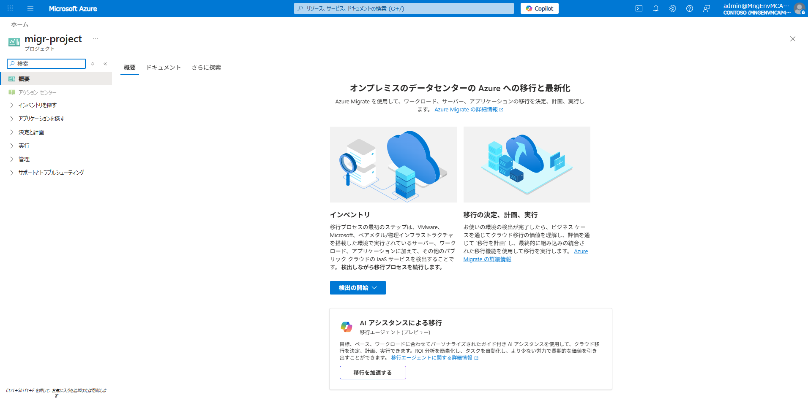
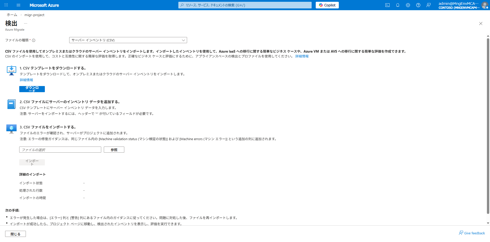
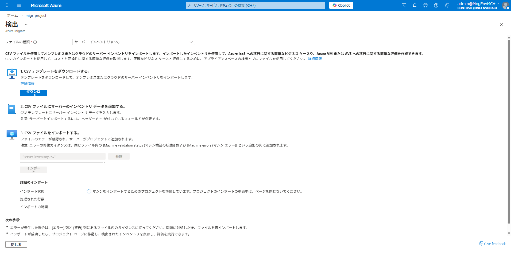

# Phase 4: 移行アセスメント

## 目的

Azure Migrate を使用して疑似オンプレ環境をアセスメントし、移行計画を策定します。

## 前提条件

- Phase 3 が完了していること
- Azure Migrate プロジェクト（`migr-project`）がデプロイ済みであること

## 手順

### 1. Azure Migrate プロジェクトの確認

Azure Portal → **Azure Migrate** → `migr-project` を開きます。

### 2. サーバーインベントリの CSV インポート

> **注**: 本ハンズオンでは Azure VM を疑似オンプレとして使用しているため、
> CSV インポートによるサーバー検出を行います。

1. Azure Migrate → **検出の開始** → ファイルの種類で **サーバー インベントリ (CSV)** を選択

   

2. **ダウンロード** から CSV テンプレートを取得し、サーバー情報を記入（`server-inventory.csv`）
3. **参照** から `server-inventory.csv` を選択し、**インポート** をクリック

   

4. インポートの進行を確認

   

5. インポート完了後、ページを更新して結果を確認

   

6. インベントリにサーバーが登録されたことを確認

   

### 3. Azure Copilot 移行エージェントの活用

Azure Migrate ポータルから Copilot 移行エージェントを起動し、自然言語で移行計画を策定:

| 機能 | 内容 |
|------|------|
| 移行戦略の分析 | Lift & Shift vs モダナイズのトレードオフ説明 |
| インベントリ分析 | 検出 VM の要約・OS 情報・サポート状況 |
| ビジネスケース / ROI | 移行によるコスト削減効果の算出 |
| 準備状況評価 | 評価結果の解釈・阻害要因の特定 |
| ランディングゾーン | ターゲット環境構成の自動生成 |

### 4. アセスメントの作成

#### Azure VM 評価

1. Azure Migrate → **Assessment** → **Azure VM** を選択
2. 対象: APP01, DB01
3. 評価結果でサイジング推奨を確認

#### Azure SQL 評価

1. **Assessment** → **Azure SQL** を選択
2. 対象: DB01 上の SQL Server 2019
3. Azure SQL Database との互換性を確認

#### Azure App Service 評価

1. **Assessment** → **Azure App Service** を選択
2. 対象: APP01 上の IIS / .NET アプリ
3. App Service への移行可否を確認

### 5. アセスメント結果の確認

| 評価種別 | 確認項目 | 対応 Spoke |
|---------|---------|-----------|
| Azure VM | 推奨 VM サイズ、準備状況 | Spoke1, Spoke2 |
| Azure SQL | 互換性、推奨 SKU | Spoke2, 3, 4 |
| App Service | 互換性、推奨プラン | Spoke4 |

## 確認ポイント

- [ ] Azure Migrate でサーバーが検出されている
- [ ] Azure VM 評価結果が表示される
- [ ] Azure SQL 評価で互換性が確認できる
- [ ] 移行先の推奨サイジングが確認できる

## 次のステップ

移行パターンに応じて次の Phase を選択:

- → [Phase 5a: Rehost](05a-rehost.md)（推奨: 最初にこれを実施）
- → [Phase 5b: DB PaaS 化](05b-db-paas.md)
- → [Phase 5c: コンテナ化](05c-containerize.md)
- → [Phase 5d: フル PaaS](05d-full-paas.md)
